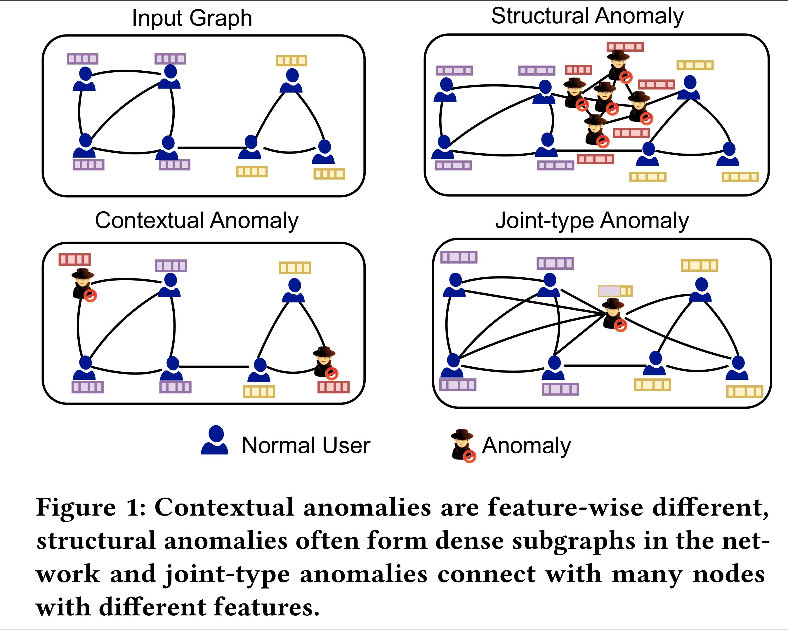
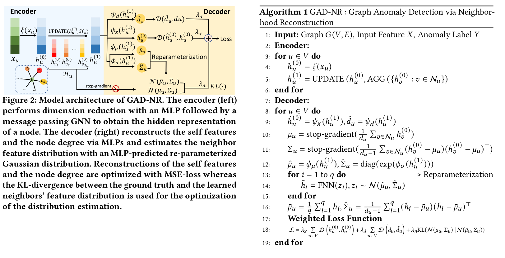
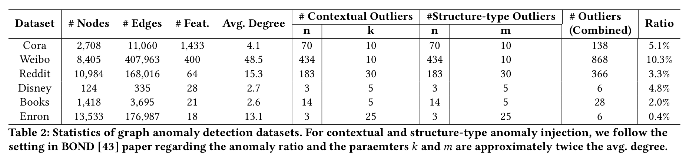
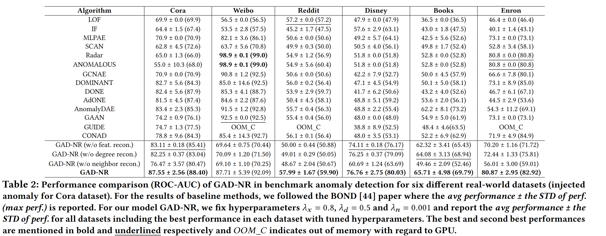
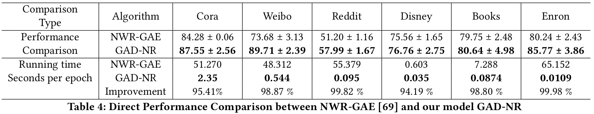
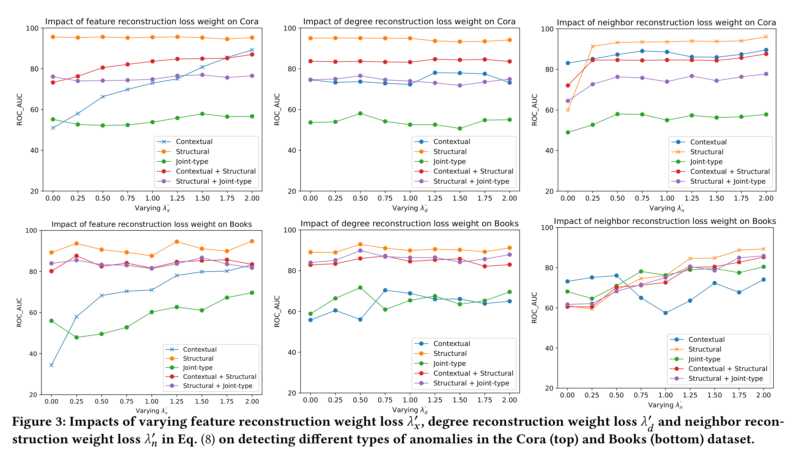

<h1 align="center">GAD-NR: Graph Anomaly Detection via Neighborhood Reconstruction</h1>
<p align="center">
    <a href="https://arxiv.org/abs/2306.01951"></a> 
    <a href="https://github.com/Graph-COM/GAD-NR/"></a>
</p>


This repository contains the official implementation of GAD-NR in the **WSDM-2024** paper "[GAD-NR: Graph Anomaly Detection via Neighborhood Reconstruction](https://arxiv.org/abs/2306.01951)" by [Amit Roy](https://amitroy7781.github.io/), Juan Shu, Jia Li, Carl Yang, Olivier Elshocht, Jeroen Smeets, [Pan Li](https://sites.google.com/view/panli-purdue/home)

## Abstract
<p align="justify">
Graph Anomaly Detection aims at identifying abnormal nodes in graphs, and is widely used in network security, fraud detection, and social media spam detection and in many other applications. Graph Auto-Encoder (GAE) is a common technique for anomaly detection, which encodes graph data into node representations and detects anomalies if parts of the graph cannot be well reconstructed based on the node representations. However, current GAE models are optimized for node feature or direct link reconstruction, which pushes nodes connected in the graph clustered in the latent space, and thus are good at detecting cluster-type structural anomalies but not as good at detecting more complex joint-type anomalies that are only detectable by considering both graph structure and node features simultaneously. Our proposed solution, <b>GAD-NR</b>, is a new type of GAE based on neighborhood reconstruction for graph anomaly detection. GAD-NR aims to reconstruct the entire neighborhood (including local structure, self attributes, and neighbors’ attributes) around a node based on the corresponding node representation. GAD-NR is supposed to detect any anomalies as long as the neighborhoods look different between normal and abnormal nodes. Extensive experimental results over six real-world datasets have demonstrated the effectiveness of GAD-NR, which outperforms state-of-the-art competitors significantly (by up to 30%↑ in AUC) over five of the six datasets. In particular, the compared methods are shown to perform well only for one or two types of anomalies among the three types of anomalies for evaluation, while GAD-NR works well to detect all three types of anomalies across the datasets.
</p>


## Contextual, Structural and Joint-type Anomaly

<p align="center">

</p>
    
<p align="justify"> 
    <b>Contextual anomalies</b> are feature-wise different, <b>structural anomalies</b> often form dense subgraphs in the network and <b>joint-type anomalies</b> connect with nodes with different features. We refer the structural and joint-type anomalies together as structure-type anomaly.
</p>


## Model Architecture


<p align="justify"> 
<b>GAD-NR: Graph Anomaly Detection via Neighborhood Reconstruction</b>. The Encoder (left) part performs dimension reduction with an MLP followed by a message passing GNN to obtain the hidden representation of a node. The Decoder (right) reconstructs the self-feature and node degree via two MLPs and estimates the neighbor feature distribution with an MLP-predicted Gaussian distribution. Reconstruction of self-feature and node degree is optimized with MSE-loss whereas the KL-divergence is used for the optimization of the neighbor features distribution estimation between ground truth and learned neighborhood feature distribution.
</p>


## Main Parameters

```
--dataset                      Anomaly detection dataset(default:inj_cora)
--encoder                      Encoder Model (default: GCN)
--sample_size                  Number of neighbors to sample (default: 10)
--dimension                    Hidden dimension to project the input features (default: 128)
--lr                           Learning Rate (default:0.01)
--epoch_num                    Number of epochs to train the model (default: 100)
--lambda_loss1                 Neighbor Reconstruction loss weight (default: 1e-2)
--lambda_loss2                 Feature Reconstruction Loss weight (default: 0.5)
--lambda_loss3                 Degree Reconstruction Loss weight (default: 0.8)
--loss_step                    Steps between of loss weight updates (default: 30)
--real_loss                    Flag for using real loss weight or adaptive loss weights for finding ROC AUC (default: False)
--h_loss_weight                Adaptive loss for neighbor reconstruction (default: 1.0)
--feature_loss_weight          Adaptive loss for feature reconstruction (default: 2.0)
--degree_loss_weight           Adaptive loss for degree reconstruction (default: 1.0)
--calculate_contextual         Flag for calculating Contextual Outlier (default: True)
--calculate_structural         Flag for calculating structure related Outlier (default: True)
--contextual_n                 Parameter for generating contextual outliers (Set based on outlier ratio of pygod paper)
--contextual_k                 Parameter for generating contextual outliers (Twice the avg. degree of the dataset)
--structural_n                 Parameter for generating structural outliers (Set based on outlier ratio of pygod paper)
--structural_m                 Parameter for generating structural outliers (Twice the avg. degree of the dataset)
--neigh_loss                   Parameter for deciding KL/W2 loss for neighborhood reconstruction (default: KL)
--use_combine_outlier          Flag for using combination of contextual and structural outlier as benchmark outlier (default: False)
```

## Environment Setup

Create Conda Environment
```
conda create --name GADNR
conda activate GADNR
```

Install pytorch:
```
conda install pytorch torchvision torchaudio pytorch-cuda=11.7 -c pytorch -c nvidia

```
Install pytorch geometric:
```
pip install pyg-lib torch-scatter torch-sparse torch-cluster torch-spline-conv torch-geometric -f https://data.pyg.org/whl/torch-1.13.0+cu117.html

```

Install requirements.txt
```
conda install --file requirements.txt
```

## Basic Usage

Run the python notebook with appropriate hyperparameter changes.

## Experimental Results

**Dataset Description**



**Benchmark Anomaly Detection  Results**



**Direct Performance comparison with NWR-GAE**



**Ablation Study on feature, degree and neighbor reconstruction weight lambda**

 


## Cite

If you find our paper and repo useful, please cite our paper:

```bibtex
@inproceedings{Roy2023gadnr,
  title  = {GAD-NR : Graph Anomaly Detection via Neighborhood Reconstruction},
  author = {Roy, Amit and Shu, Juan and Li, Jia and Yang, Carl and Elshocht, Olivier and Smeets, Jeroen and Li, Pan},
  booktitle={Proceedings of the 17th ACM International Conference on Web Search and Data Mining},
  year   = {2024}
}
```
## Reference 

The codebase of this repo is partially based on [NWR-GAE](https://github.com/mtang724/NWR-GAE) repository.

## Star History

[](https://star-history.com/#graph-com/gad-nr&Date)
