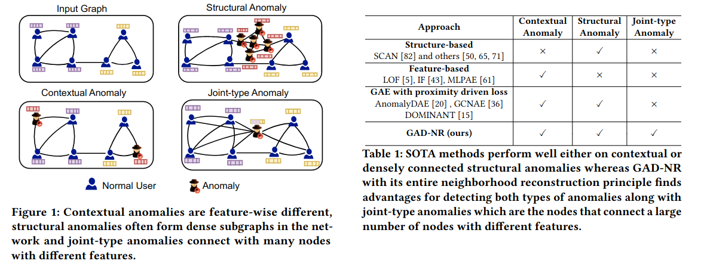

# GAD-NR: Graph Anomaly Detection via Neighborhood Reconstructoin


**Contextual, Structural and Joint-type Anomaly Detection**



SOTA anomaly detection methods perform well either on contextual outliers or densely connected structural outliers whereas GAD-NR with its entire neighborhood reconstruction module can perform well on both types of outlier detection and is capable to detect joint structural outliers which are nodes with dense connections.


**Model Architecture**


Graph Anomaly Detection via Neighborhood Reconstruction, GAD-NR. The Encoder (left) part utilizes a Multi-Layer Perceptron (MLP) for dimension reduction followed by a message passing GNN to obtain the hidden representation of a node. The Decoder (right) reconstructs the self-feature and  node degree via two MLPs and predicts the neighbor feature via sampling from an MLP-predicted Gaussian distribution. Reconstruction of self-feature and node degree is optimized with MSE loss whereas the KL-divergence between the originally sampled and reconstructed neighbor feature is used for the optimization of the neighbor features.


**Main Parameters:**

```
--dataset                      Anomaly detection dataset(default:inj_cora)
--encoder                      Encoder Model (default: GCN)
--sample_size                  Number of neighbors to sample (default: 10)
--dimension                    Hidden dimension to project the input features (default: 128)
--lr                           Learning Rate (default:0.01)
--epoch_num                    Number of epochs to train the model (default: 100)
--lambda_loss1                 Neighbor Reconstruction loss weight (default: 1e-2)
--lambda_loss2                 Feature Reconstruction Loss weight (default: 0.5)
--lambda_loss3                 Degree Reconstruction Loss weight (default: 0.8)
--loss_step                    Steps between of loss weight updates (default: 30)
--real_loss                    Flag for using real loss weight or adaptive loss weights for finding ROC AUC (default: False)
--h_loss_weight                Adaptive loss for neighbor reconstruction (default: 1.0)
--feature_loss_weight          Adaptive loss for feature reconstruction (default: 2.0)
--degree_loss_weight           Adaptive loss for degree reconstruction (default: 1.0)
--calculate_contextual         Flag for calculating Contextual Outlier (default: True)
--calculate_structural         Flag for calculating structure related Outlier (default: True)
--contextual_n                 Parameter for generating contextual outliers (Set based on outlier ratio of pygod paper)
--contextual_k                 Parameter for generating contextual outliers (Twice the avg. degree of the dataset)
--structural_n                 Parameter for generating structural outliers (Set based on outlier ratio of pygod paper)
--structural_m                 Parameter for generating structural outliers (Twice the avg. degree of the dataset)
--neigh_loss                   Parameter for deciding KL/W2 loss for neighborhood reconstruction (default: KL)
--use_combine_outlier          Flag for using combination of contextual and structural outlier as benchmark outlier (default: False)
```

**Environment Setup:**

Create Conda Environment
```
conda create --name GADNR
conda activate GADNR
```

Install pytorch:
```
conda install pytorch torchvision torchaudio pytorch-cuda=11.7 -c pytorch -c nvidia

```
Install pytorch geometric:
```
pip install pyg-lib torch-scatter torch-sparse torch-cluster torch-spline-conv torch-geometric -f https://data.pyg.org/whl/torch-1.13.0+cu117.html

```

Install requirements.txt
```
conda install --file requirements.txt
```

**Basic Usage:**

Run the python notebook with appropriate parameter changes.

